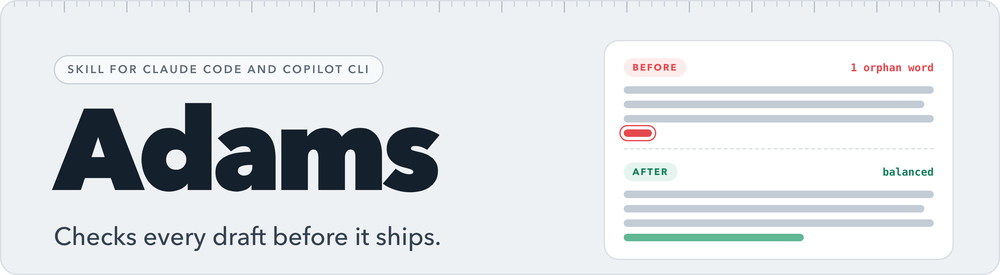
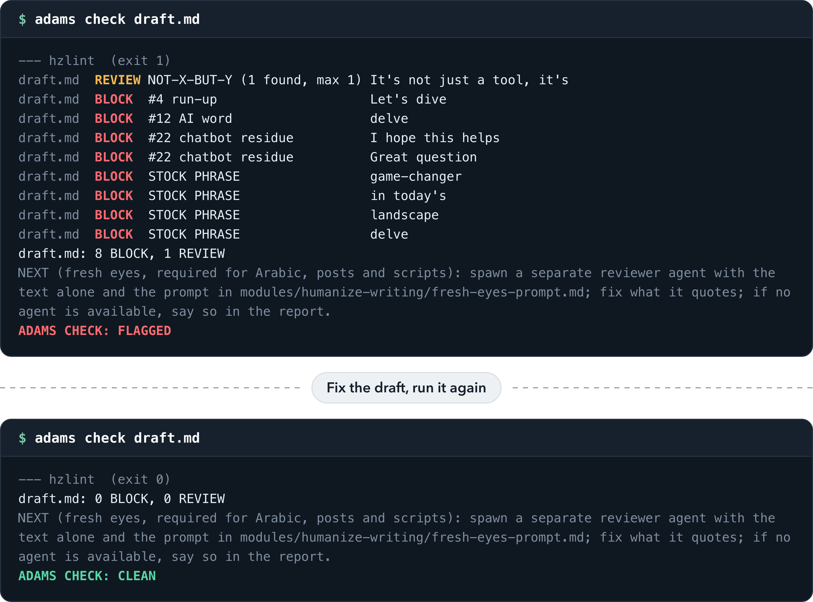
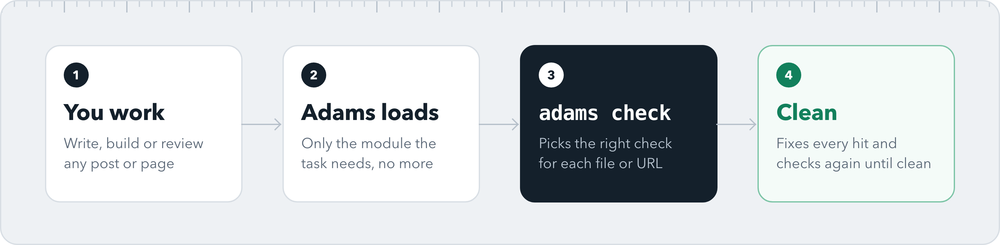
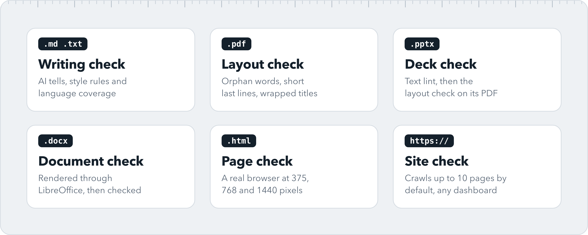

  

  
  
  
  

One skill for Claude Code and GitHub Copilot CLI that makes the work better on any project: text that does not read as AI-written, layout and visual checks, a workflow for planning and debugging, shared product principles, and standards for building SaaS. It runs its checks on its own, so nobody has to remember to ask.

Created by Adam Hafez at [UpgradIQ](https://github.com/UpgradIQ). MIT licensed.

## See it work

A draft full of AI tells fails. The same draft, rewritten, passes. Both runs are real output of `adams check`.

## How it works

Adams loads on matching tasks, runs the check that fits what you built or wrote, fixes every hit and checks again. Nothing is called by hand, and nothing is reported as passed unless it ran.

## What gets checked

## Modules

| Module | Use it for |
|---|---|
| `product-principles` | how to decide: truth over wishes, focus, ethical persuasion, no dark patterns |
| `humanize-writing` | text that does not read as AI-written, in English and Arabic (26 English tells plus Arabic style rules) |
| `line-balance`, `deliverable-visual-qa` | no orphan words, equal cards, contrast, RTL, for PDFs, decks, docs, websites and dashboards |
| `workflow` | grill a plan, diagnose bugs with a feedback loop, handoff, retro, complete output |
| `senior-frontend` | Next.js, Supabase, Stripe, Sentry, a security checklist, a SaaS revamp program with a tracker |
| `seo-architect`, `innovation-builder`, `obsidian-vault-memory` | SEO site blueprints, WordPress canvases and worksheets, an Obsidian vault as memory |

## Install

You need Python 3.9+, Node 18+ and git. LibreOffice is optional (pptx and docx checks).

### Claude Code plugin

    /plugin marketplace add UpgradIQ/adams
    /plugin install adams@adams

### Any terminal, Claude Code and Copilot CLI together

This works in Warp, iTerm or any shell.

    git clone https://github.com/UpgradIQ/adams.git ~/adams
    ~/adams/bin/adams install --dry-run     # shows exactly what it will change
    ~/adams/bin/adams install
    export PATH="$HOME/.local/bin:$PATH"    # add to your shell profile
    adams sync                              # Copilot instructions
    adams doctor                            # what is missing and how to fix it

Start a new Claude Code or Copilot session afterwards (skills and hooks load at session start). Use one install method, not both. `adams uninstall` removes exactly what `install` added.

## Use

Nothing to call. You can also run it by hand: `adams check report.pdf`, `adams check article.md`, `adams check https://example.com`. `adams selftest` verifies the toolkit itself.

## Profiles and per-project settings

Rules are grouped into profiles. `default` carries only universal AI-writing tells. `strict-ar` adds Arabic style, register and post-layout rules. Pick one per project in `.adams/config.json` (`{"profile": "strict-ar"}`) or per person in `~/.config/adams/config.json`. Your own preferences go in `~/.config/adams/profiles/<name>.json` (a profile may `extends` another) and are never part of this repository.

## What it touches (read before installing)

`adams install` adds symlinks and two hooks to `~/.claude/settings.json` (with a backup). The hooks are local scripts: a guardrail that blocks risky git commands such as `git add -A`, `reset --hard` and force pushes (plain `git push` is allowed), and a reminder to run the checks. On first use the layout checkers install pinned dependencies (Playwright and Chromium, pdfplumber, Pillow); set `ADAMS_AUTO_INSTALL=0` to forbid that. There is no telemetry. See [SECURITY.md](SECURITY.md).

## Contributing

See [CONTRIBUTING.md](CONTRIBUTING.md). `adams selftest` must print `selftest OK`; CI runs it on a fresh clone. Third-party credits are in [NOTICE](NOTICE). The images in `docs/assets` are rendered from `docs/visuals/src` with `node docs/visuals/render.js`.
